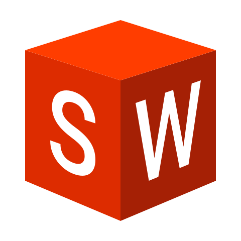

<h1 align="center">
	<a href="https://github.com/mobinbyn">Mobin Byn</a> 
	
</h1> 

## About Me:

	I'm

> Wear your learning, like your watch, in a private pocket. Do not pull it out merely to show that you have one. If asked what o’clock it is, tell it; but do not proclaim it hourly and unasked, like the watchman.
> -- Lord Chesterfield

>دانسته هایتان را مانند یک ساعت مچی در دست کنید، نه صرفا به این خاطر که نشان دهید آن را دارید. بلکه به این خاطر که اگر کسی از شما ساعت را پرسید، برایش بگویید.
>--لرد چسترفیلد

 

## Contact & Follow me:

		
		
		
		
		
		
	

     

# ***Languages and Tools:***

 
	
	
	
	
	
	
	
	
	
	
	
	
	
	
	
	
	
	
	
	
	
	
	
	
	

 

